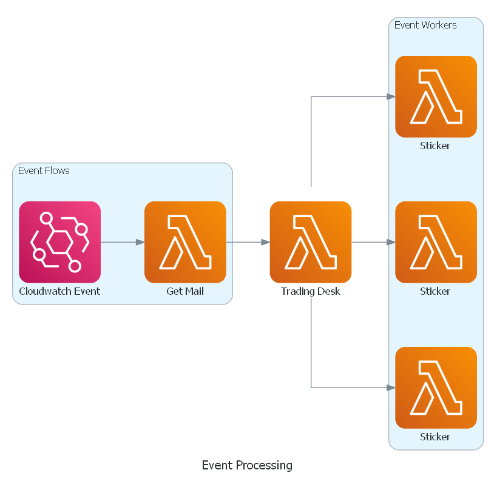

# ARK Trading Desk
[](https://github.com/EddieKuo723/ARK-Invest-Trading-Desk/actions)
[](https://github.com/EddieKuo723/ARK-Invest-Trading-Desk/blob/master/LICENSE)


### Introduction:

The **ARK Invest Trade Broadcast** project offers a streamlined solution for tracking and disseminating all purchase and sale transactions executed by [ARK Invest](https://ark-funds.com/subscribe). Leveraging the power of Telegram, this project automatically broadcasts real-time updates of ARK Invest's trading activities to a designated Telegram channel.

## Architecture
<p align="center">
<a>
	
</a>

<p align="center">

## Building

1) Run `pip install -r requirements.txt` in each function folder
2) *Optional*: setup environment variable with settings:
   ```
   DYNAMODB_TABLE=******
   DYNAMODB_HASHKEY=***********
   BOT_ID=*********
   CHANNEL_ID=*********
   CHAT_ID=********
   IMG_URL=************
   ```

## Deploy

We've streamlined the deployment process with GitHub Actions. By using our GitHub Action, you can easily deploy Lambda code to update functions.

### Input 
See [Deploy_Get_ARK_Email.yml](/.github/workflows/Deploy_Get_ARK_Email.yml) for more detailed information.
* function-name: Get_ARK_Email

### Github Action Secrets 
* AWS_ACCESS_KEY_ID - AWS Access Key Id
* AWS_SECRET_ACCESS_KEY - AWS Secret Key
* AWS_DEPLOY_IAM_ARN - [AWS Lambda IAM Role](/IAM_Config)
* LAMBDA_VARIABLE - Lambda Functions Environment Variable

## Example
```
ARKK INNOVATION ETF
Buy
- ZM
Zoom Video Communications Inc
- SHOP
Shopify Inc
- EXAS
Exact Sciences Corp

Sell
- HUYA
Huya Inc
```

## AWS Policy

To integrate with GitHub Actions, add the following AWS policy. Please replace REGION, ACCOUNT, and LAMBDA_NAME with your specific data.

```json
{
  "Version": "2012-10-17",
  "Statement": [
    {
      "Effect": "Allow",
      "Action": [
         "lambda:CreateFunction",
         "lambda:UpdateFunctionCode",
         "lambda:GetFunction",
         "lambda:UpdateFunctionConfiguration",
         "iam:ListRoles",
         "iam:PassRole"
      ],
      "Resource": "arn:aws:lambda:${REGION}:${ACCOUNT}:function:${LAMBDA_NAME}"
    }
  ]
}
```

## License

This project is released under the MIT license.
For more details, take a look at the [LICENSE](LICENSE) file.

### Disclaimer:

This project is not affiliated with ARK Invest. It is an independent initiative developed to enhance transparency and accessibility for investors interested in tracking ARK Invest's trading activities.